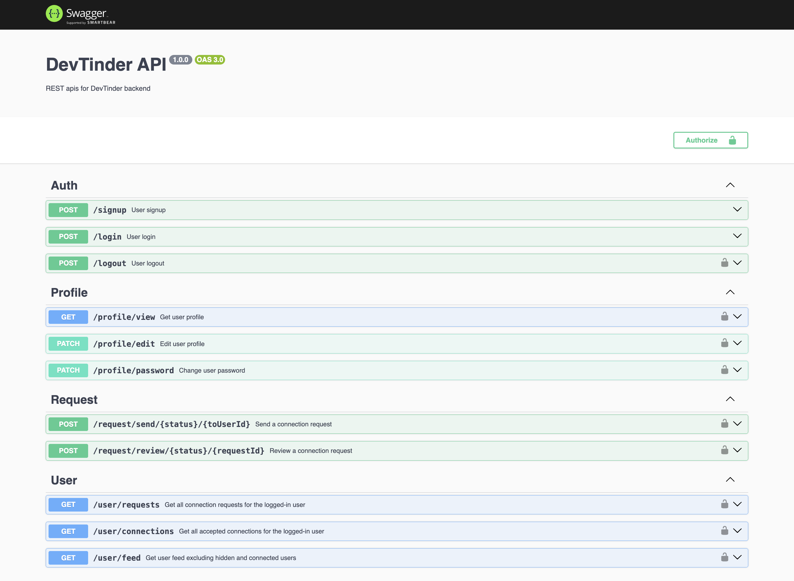

# PairPro

## Description

PairPro is a web application that allows users to connect with each other based on their interests and skills. It provides a platform for users to find and connect with others who share similar interests and skills.

## Features

- User registration and login
- User profile management
- Connection requests and connection management
- User feed and search functionality
- User profile and connection management

## Technologies

- Node.js
- Express.js
- MongoDB
- Swagger

## Installation

To get started with PairPro, follow these steps:

1. Clone the repository
2. Install dependencies
3. Create a .env file and add the necessary environment variables
4. Run the application
